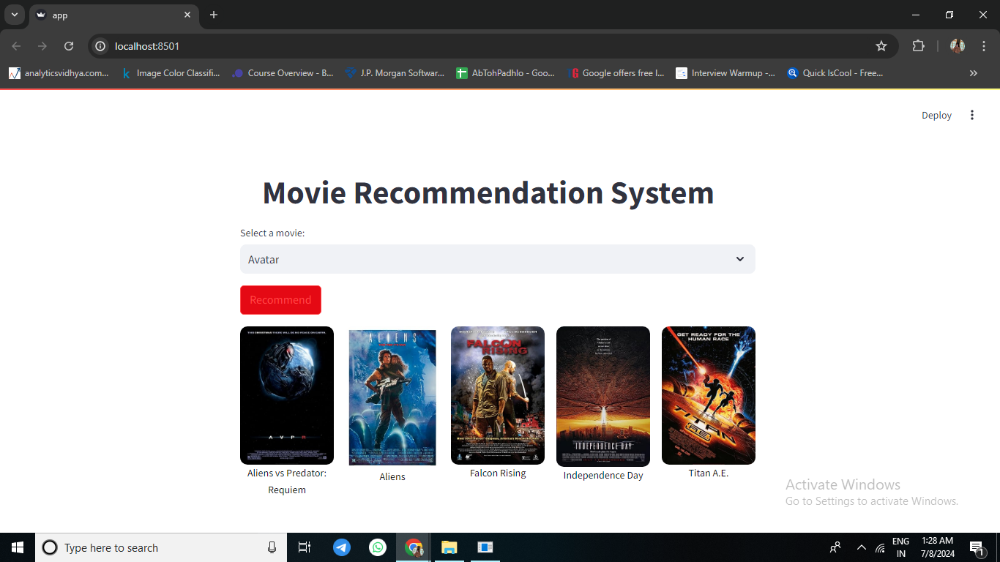

# Movie Recommendation System
A Movie Recommendation System that recommends five movies based on the movie selected by the user.
## Description
This project is built using Python, sklearn, NLTK, and pickle, with a simplistic website created using Streamlit. The dataset includes nearly 5000 movies sourced from IMDb, 
which has been processed using pandas and numpy. Tags for movies were created using this data. Using sklearn's cosine similarity metrics, vectors were created based on the tags, which are used for prediction.
## Usage
To use the Movie Recommendation System, follow these steps:
1. Start the Streamlit app:
  streamlit run app.py
2. Select a movie from the dropdown list to get recommendations.
## Demonstration
Here is a screenshot of the website:

## Features
1. Recommends five movies based on the selected movie
2. Utilizes cosine similarity metrics for predictions
3. Processes a dataset of nearly 5000 movies
4. Simplistic and user-friendly website created using Streamlit
## Installation
To install and set up the Movie Recommendation System, follow these steps:
* Clone the repository : 
"git clone https://github.com/GirishaSingh/movie-recommendation-system.git"
* Navigate to the project directory: 
"cd movie-recommendation-system"
* Install dependencies : 
"pip install -r requirements.txt"
## Contact
* Your Name - Girisha Singh 
* Project Link: https://github.com/GirishaSingh/movie-recommendation-system
## Acknowledgments
* Thanks to IMDb for providing the dataset.
* Special thanks to the developers of Streamlit, sklearn, NLTK, pandas, and numpy for their amazing tools.
